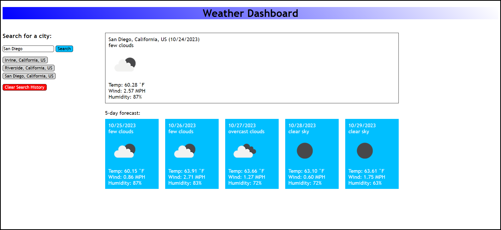
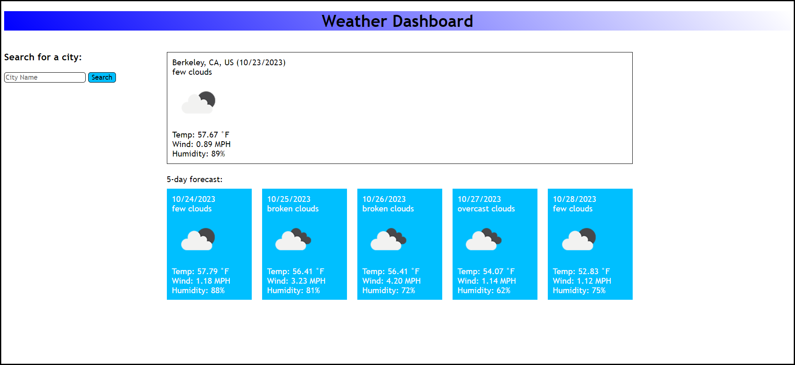
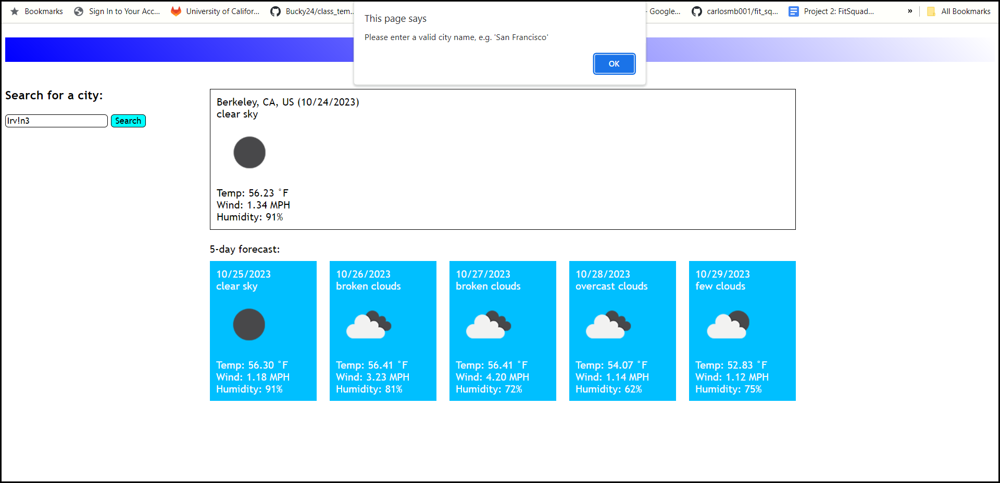
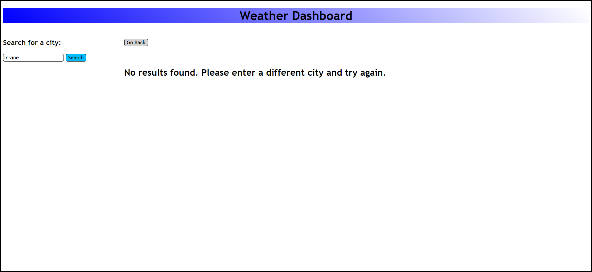
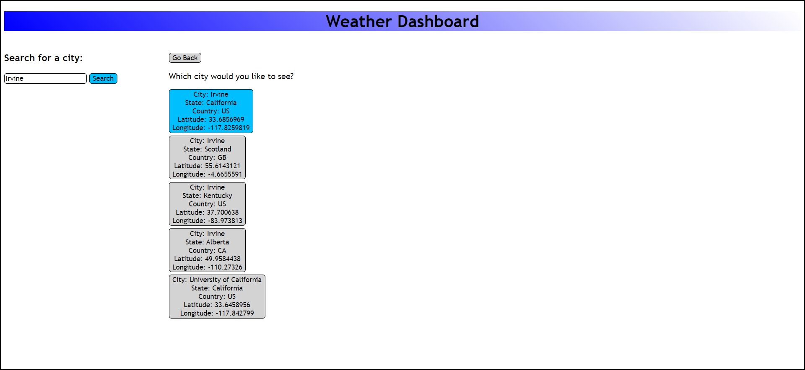
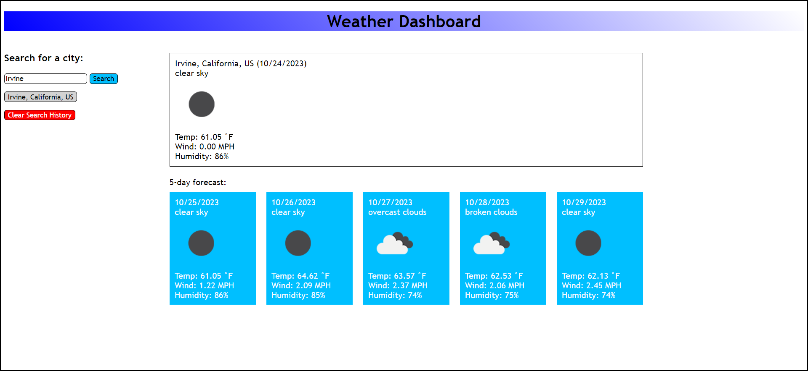
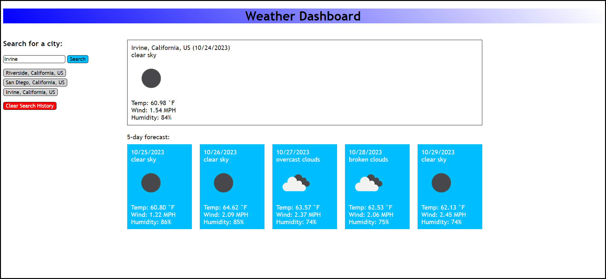
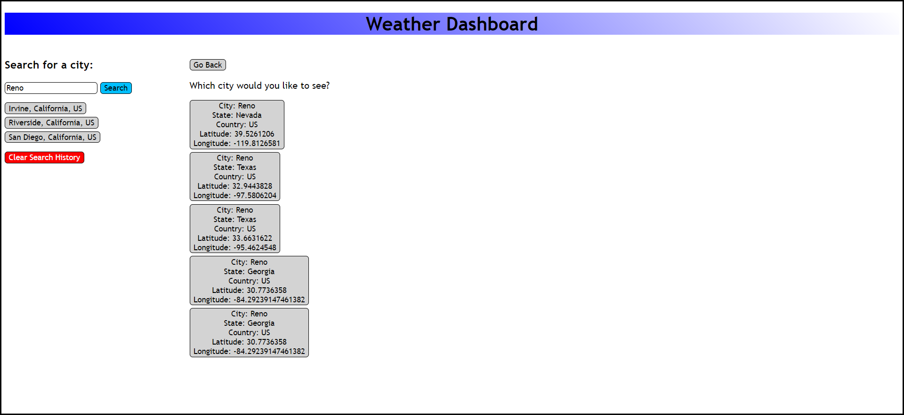

# Challenge 6: Interactive Weather Forecast App

## Description
Traveling to new places and creating fun memories can be rewarding and exciting. However, weather can vary greatly depending on location, and it can be difficult to find important information such as temperature, wind speed, and humidity. This application addresses that issue by fetching current and future weather data for any city from the OpenWeatherMap API. When you search for a city, you will be able to choose from a list of options. This action will show you the weather data for the selected location. This project taught me how to fetch and process data from an API, show and hide certain sections of the page, and attach event listeners to buttons by looping through them.

## Table of Contents
- [Description](#description)
- [Installation](#installation)
- [Usage](#usage)
- [Credits](#credits)
- [Contributing](#contributing)
- [Tests](#tests)
- [License](#license)
- [Questions](#questions)

## Installation
No installation is required for this project.

## Usage
When the application is launched, you will be presented with a city input form, your previous search history, and current and future weather data. If you have searched for at least one city, the data for your most recent city will be loaded:

However, if you have not made any searches yet, `Berkeley, CA` is loaded by default:

Only letters, spaces, periods, and commas are allowed in the search query:

**Important:** The search is not case sensitive, but it is likely to fail if you enter a name with typos or unnecessary/missing spaces.

**Correct: Irvine** 
**Incorrect:**

**Ir vine:**

**Ifvine:**

Once you enter a city name properly, you can view a list of up to five options:

Once you click an option, you will be taken back to the forecast page where you will see the weather data corresponding to its latitude and longitude:

**Note:** If you search for a previous city again, it will be moved to the front (bottom) of your search history, as shown below.

**San Diego used to be the most recent city:**

The deployed application can be found [here](https://gimmekitties711.github.io/challenge_6-interactive_weather_forecast_app/).

**Special case:** Searching for `Reno` yields two identical results for `Reno, Georgia`:

However, this is not something to be concerned about, as both options behave the same way and return the same data. I attempted to remove the duplicate option, but unfortunately, my efforts were unsuccessful.

## Credits
Received assistance from students Avery Myers, Kevin Smith, and Michael Taraschi. Also received help from TA Michael Seaman and instructor Robbert Wijtman.

The following web resources helped me write the code for this project:

1. [Stack Overflow: How to position two divs side-by-side](https://stackoverflow.com/questions/5387392/how-to-get-these-two-divs-side-by-side)
2. [Stack Overflow: Understanding JSON, promises, and .then()](https://stackoverflow.com/questions/37555031/why-does-json-return-a-promise-but-not-when-it-passes-through-then)
3. [How to get the current date in dayjs](https://day.js.org/docs/en/parse/now)
4. [How to format a date in dayjs](https://day.js.org/docs/en/display/format)
5. [Weather icons, their meanings, and how to use them](https://openweathermap.org/weather-conditions)
6. [Stack Overflow: How to round a number to 2 decimal places](https://stackoverflow.com/questions/11832914/how-to-round-to-at-most-2-decimal-places-if-necessary)
7. [The replaceAll() method](https://developer.mozilla.org/en-US/docs/Web/JavaScript/Reference/Global_Objects/String/replaceAll)
8. [The hasChildNodes() method](https://www.w3schools.com/jsref/met_node_haschildnodes.asp)
9. [The mouseover event](https://developer.mozilla.org/en-US/docs/Web/API/Element/mouseover_event)
10. [The mouseleave and mouseout events](https://developer.mozilla.org/en-US/docs/Web/API/Element/mouseleave_event)

## Contributing
This application currently does not have the ability to delete individual search history entries. If someone could help me implement that feature, I would very much appreciate it.

## Tests
No tests have been written for this application.

## License
No license is attached to this repository.

## Questions
If you have any questions for me, you can [follow me on GitHub](https://github.com/GimmeKitties711) or email me at eric20wang.wang@gmail.com.
